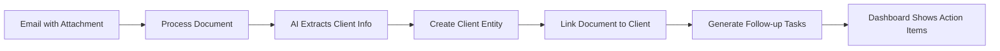

# 🎯 NotebookBobu CRM Integration - Phase 1 Complete

## ✅ **What We Built**

### **Document-Centric CRM** 
Instead of building a separate CRM, we enhanced your existing document processing with client intelligence:

- **Client Profiles** linked to processed documents
- **Unified Communication Timeline** (emails, documents, calls, notes)  
- **AI-Powered Insights** from client interactions
- **Smart Task Management** with AI suggestions
- **CRM Dashboard** integrated with your existing API

### **Clean Architecture**
Following your existing Domain-Driven Design patterns:

```
app/domain/client/
├── entity/          # Client, Communication, Task entities
├── repository/      # Data access interfaces  
└── service/         # Business logic
```

## 🚀 **Key Features Implemented**

### **1. Client Management**
```python
# Core client entity with business context
class Client:
    name, email, phone, address
    client_type: beginner|intermediate|advanced
    equipment_preference: sabre|epee|foil
    total_lessons, outstanding_balance
    engagement_score, document_count
```

### **2. Document-Client Linking**
```python
# Enhanced Document entity
class Document:
    client_id: Optional[str]           # Links to client
    client_context: "email_attachment" # How document relates to client
```

### **3. Unified Communication Timeline**
```python
# All client interactions in one place
class Communication:
    type: email|phone_call|document|note
    content, document_id, outcome
    requires_followup, sentiment_analysis
```

### **4. Smart Task Management**
```python
# AI-suggested and manual tasks
class Task:
    title, due_date, priority
    is_ai_suggested: bool
    ai_reasoning: "Client hasn't been contacted in 30+ days"
```

## 📡 **New API Endpoints**

### **Client Management**
- `POST /api/clients` - Create client
- `GET /api/clients` - List with filtering
- `GET /api/clients/{id}` - Full context (comms + tasks + insights)
- `PUT /api/clients/{id}` - Update client info

### **Document-Client Integration** ⭐
- `POST /api/documents/{id}/link-client` - Link existing document to client
- `POST /api/documents/{id}/create-client` - **Main workflow: Create client from document**

### **Task & Communication**
- `POST /api/tasks` - Create follow-up tasks
- `GET /api/tasks` - List with filtering
- `PUT /api/tasks/{id}/complete` - Mark complete

### **AI Features** 🤖
- `GET /api/clients/{id}/insights` - AI analysis of client
- `GET /api/clients/{id}/suggest-actions` - AI-suggested follow-ups

### **Dashboard**
- `GET /api/crm/dashboard` - Today's tasks, overdue items, client activity

## 🗄️ **Database Schema**

Created complete Supabase schema in `database/client_schema.sql`:

- **`notebookbobu_clients`** - Core client profiles
- **`notebookbobu_communications`** - Unified interaction timeline  
- **`notebookbobu_tasks`** - Follow-up actions
- **`notebookbobu_client_insights`** - AI-generated analysis
- **Enhanced `notebookbobu_documents`** - Added client_id linkage

All tables have proper **Row Level Security** for multi-tenant safety.

## 🔄 **Main Workflow: Email → Client**



This transforms your document processor into a **client intelligence system**.

## 🧪 **Testing**

Run `python test_crm_integration.py` to verify:
- ✅ Domain entities work correctly
- ✅ API structure is valid  
- ✅ Integration points are defined

## 📋 **Next Steps to Go Live**

### **1. Database Setup** (5 min)
```bash
# Run this in your Supabase SQL editor
psql -f database/client_schema.sql
```

### **2. Repository Implementation** (2 hours)
Create Supabase repository classes:
```python
# app/infrastructure/repository/client_repository.py
class SupabaseClientRepository(ClientRepositoryInterface):
    async def create_client(self, client: Client) -> Client:
        # Implement with supabase client
```

### **3. Service Container Registration** (30 min)
```python
# app/core/container.py  
container.client_service = ClientService(client_repo, comm_repo, task_repo)
```

### **4. AI Integration** (1 hour)
Replace mock insights with real OpenAI calls:
```python
# Use existing OpenAI service to analyze client communications
insights = await openai_service.analyze_client_context(communications)
```

### **5. Test with Real Data** (30 min)
Process a real email attachment → create client → verify workflow

## 🎯 **Business Impact**

**Before**: Documents processed in isolation
**After**: Documents become client intelligence that drives business actions

This **enhances** rather than **bloats** because it makes your existing document processing contextual and actionable.

## 💡 **Future Enhancements** (Post-Launch)

- **Email Integration**: Auto-create communications from inbox-zero emails
- **Lesson Scheduling**: Calendar integration for client appointments  
- **Payment Tracking**: Link with payment systems
- **Advanced AI**: Sentiment analysis, churn prediction, personalized outreach
- **Mobile Dashboard**: Quick task completion on-the-go

---

**Ready to revolutionize your document processing into a complete client intelligence system!** 🚀